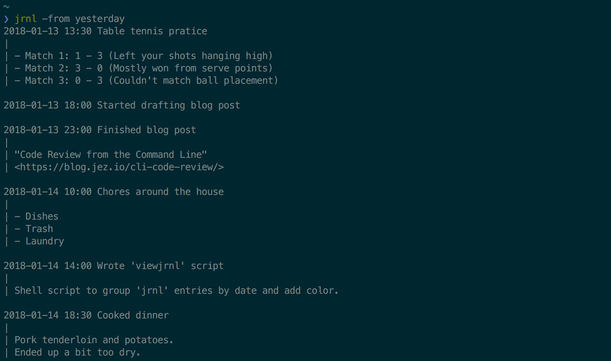

# viewjrnl

> Shell script to group `jrnl` entries by date and add color.

The default output from `jrnl` is pretty plain. `viewjrnl` is a nicer way to
read entries from `jrnl` at the command line. Here it is in action:


For comparison, this is what the plain `jrnl` output looks like:



As seen in the screenshot, the features of `viewjrnl` include:

- Grouping entries by date, to see where one day ends and another starts.
- 12-hour timestamps, which are what I'm more used to reading.
- Colorized output, so it's pleasant to look at.

## Install

`viewjrnl` depends on `jq` version 1.6 or higher. At the time of writing, you'll
have to install the release candidate to use version 1.6. On macOS:

```
# If you already have jq < 1.6:
brew reinstall --devel jq

# Otherwise, to install it for the first time:
brew install --devel jq
```

After that, `viewjrnl` is just a single shell script. You can download it and
put it on your path anywhere. Alternatively, on macOS:

```
brew install jez/formulae/viewjrnl
```

## Usage

`viewjrnl` accepts any arguments you give it and passes them on to `jrnl`.
Alternatively, omit arguments to view your jrnl for today. Examples:

```bash
# See jrnl for just today
viewjrnl

# See jrnl for last week
viewjrnl -from 'last week'

# See last 10 jrnl entries
viewjrnl -n 10

# See all jrnl entries tagged @important:
viewjrnl @important
```

## License

[](https://jez.io/MIT-LICENSE.txt)
